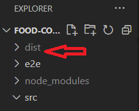

# Food Court Management App AWS Deployemnt

This repo contains only this READEME file, to document the process of deploying the app to AWS.

### Getting your instance ready
1. First, create a EC2 instance ***Ubuntu / t2.micro***.
2. Configure security groups to allow HTTP traffic.
3. Establish SSH connection with your instance so you can begin work.
4. The upcoming command will install and configure some work for us `curl https://gist.githubusercontent.com/cornflourblue/f0abd30f47d96d6ff127fe8a9e5bbd9f/raw/e3047c9dc3ce8b796e7354c92d2c47ce61981d2f/setup-nodejs-mongodb-production-server-on-ubuntu-1804.sh | sudo bash`

### Deploy NodeJS + MongoDB Back-end API
We will keep both Back-end and Front-end separate from each other.

1. Navigate to /opt then run `mkdir back-end`
2. Then, clone back-end repo with this command `sudo git clone https://github.com/HossamMamd0uh/food-court-management-app-backend /opt/back-end`
3. Now you can navigate into back-end dir and run `npm install` to get started
4. We will use pm2 to run our back-end server, so navigate to back-end/src and run `sudo pm2 start server.js`

 For more info about pm2, you can check this [link](https://www.npmjs.com/package/pm2)

 ### Deploy Angular Front-end
 Now we have our back-end and database up & running, so we can serve our front-end

 1. On tour local machine, clone front-end repo, just run `git clone https://github.com/HossamMamd0uh/food-court-management-app-frontend`
 2. Now inside the repo dir, run `ng build` and wait
 3. Now you have a dist dir, it contains your build files:  

4. On your AWS instance make a new dir for front-end, navigate to /opt and run `sudo mkdir front-end`
5. Inside it you should put the files that your dist file contains, you can use filezilla for this, you can find it [here](https://filezilla-project.org/) and here's a good documentation on how to use filezilla with EC2 [link](https://stackoverflow.com/questions/16744863/connect-to-amazon-ec2-file-directory-using-filezilla-and-sftp)


### Configuring NGINX
We need to configure NGINX to serve our files

1. Delete the default NGINX site config file with the command `sudo rm /etc/nginx/sites-available/default`
2. Launch the nano text editor to create an new default site config file with `sudo nano /etc/nginx/sites-available/default`
3. Paste in the following config:
````
server {
  charset utf-8;
  listen 80 default_server;
  server_name _;

  # angular app & front-end files
  location / {
    root /opt/front-end;
    try_files $uri /index.html;
  }

  # node api reverse proxy
  location /api/ {
    proxy_pass http://localhost:3255/;
  }
}
````
4. Save the file by pressing `ctrl+x` and select **Yes** to save.
5. Now restart NGINX to reflect our configuration

### Quick explanation of NGINX config
1. `server { ... }` -> defines a server block which contains the configuration for a virtual server within NGINX.
2. `charset utf-8` -> uses the charset directive to configure the virtual server to send all content with UTF-8 encoding.
3. `listen 80 default_server` -> uses the listen directive to configure the virtual server to accept requests on port 80 and sets it as the default virtual server on this NGINX server.
4. `server_name _` -> uses the server_name directive to set the server name to an underscore (_) to make this server block a catch-all block that matches any domain name that doesn't match another more specific server block. Since this example has only one server block it will match all domain names.
5. `location / { ... }` -> defines a location block which contains the configuration for requests that have a URI beginning with a forward slash (/), unless the request URI matches another more specific location block.
6. `root /opt/front-end/dist` -> uses the root directive to set the root directory to the front end dist folder (/opt/front-end/dist) for requests matching this location block.
7. `try_files $uri /index.html` -> uses the try_files directive to first check for the existence of a file matching the request URI ($uri) and returning it if there is one. If no file matches the request URI then it defaults to returning /index.html.
8. `location /api/ { ... }` -> defines a location block which contains the configuration for requests that have a URI beginning with /api/.
9. `proxy_pass http://localhost:3255/` -> uses the proxy_pass directive to proxy requests beginning with /api/ through to the Node.js API running at http://localhost:3255/.

From here, your app is up & running, test your new MEAN Stack application, and happy coding. :smiley: